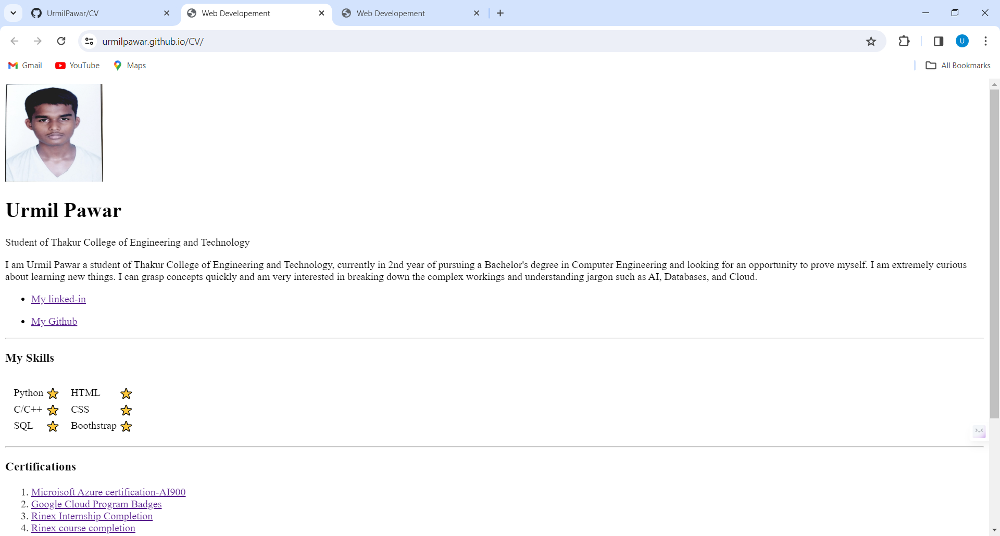

### A simple HTML CV
The project was one of our tasks in PMKVY training to learn some fundamental concepts of HTML
The CV consists of three pages
- Introduction
- Hobbies
- Contact

### Following is the image

